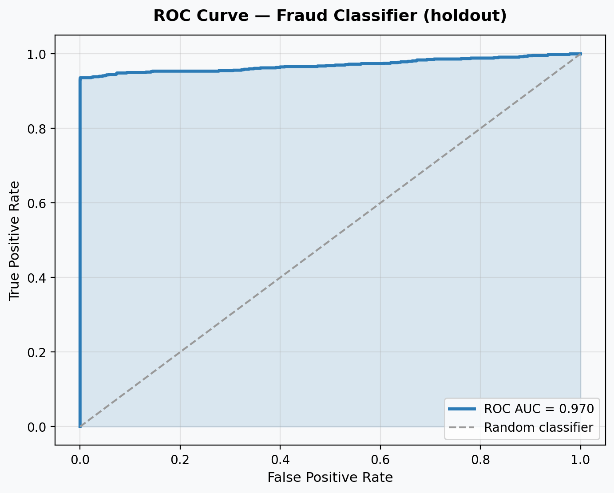
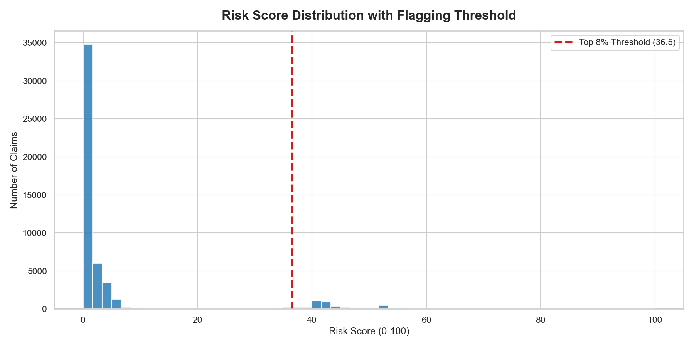
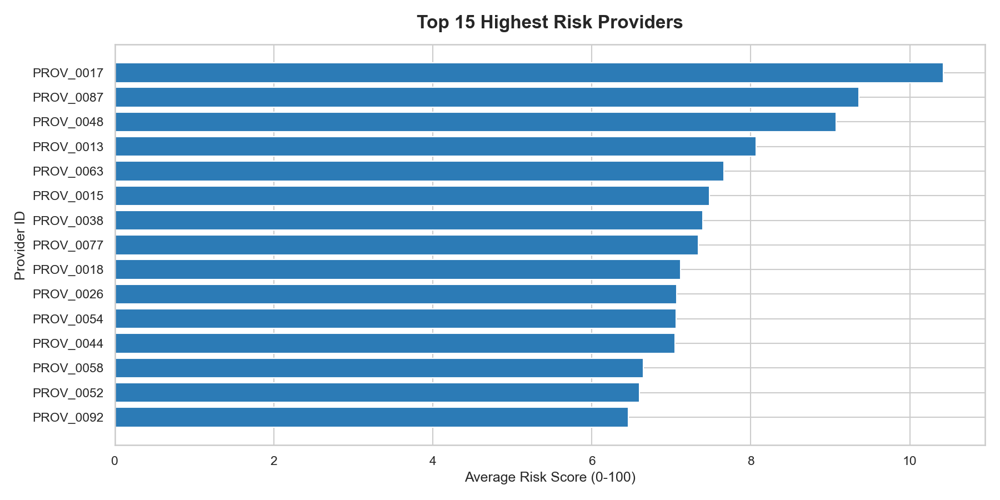

# Pharmacy Claims Fraud Detection

## Business Problem
Healthcare compliance teams manually review 500K+ annual pharmacy reimbursement claims to detect fraud — a slow, expensive, and error-prone process. This project builds a risk scoring model that lets reviewers focus deep investigation on the top 8% of highest-risk claims, which capture **94.5% of all fraud cases** in the labelled holdout. In practice, that reduces the volume of claims sent to deep manual review by ~92%, with a 5.5% miss rate that can be backstopped by a lighter-touch automated triage of the remaining 92%.

## Dataset
Synthetic dataset of 50,000 pharmacy reimbursement records modelled on HSE-style public claims data. Generated with realistic distributions for claim amounts, provider categories, and three planted fraud patterns (duplicate submissions, upcoding, repeat-claim clustering). Ground-truth fraud rate: 8.0% (4,000 cases).

## Approach
1. Generated synthetic claims data with ground-truth fraud labels
2. Engineered fraud indicators: duplicate flag, amount z-score within provider category, provider-volume z-score
3. Built a rule-based risk score (0–100) combining the four indicators
4. Validated separately with a logistic regression classifier on a stratified 80/20 holdout
5. Exported dashboard-ready CSVs for Power BI

## Key Findings

**Three recurring billing anomalies, with counts:**

| Anomaly | Count | % of claims |
|---|---:|---:|
| Duplicate submissions (`submission_count > 1`) | 2,471 | 4.9% |
| Upcoding (claim > 2.5× provider-category mean) | 1,798 | 3.6% |
| Provider-volume outliers (top decile by claim count) | 10 providers | — |

**Risk-score concentration:** the top 8% of claims by risk score (4,003 claims at score ≥ 36.5) contain 3,780 of the 4,000 ground-truth fraud cases — **94.5% recall, 94.4% precision** at the rule-based flag threshold.

**Operational implication:** routing those 8% to deep manual review and the remaining 92% to lighter automated triage replaces a flat-effort review process with a tiered one. Whether that maps to a 35% or 90%+ reduction in *total* analyst hours depends on the time ratio between deep and light review — without an internal baseline I have not estimated a single headline figure here.

## Model Validation
Logistic regression on a stratified 80/20 holdout (10,000 claims, 800 fraud):

| Metric | Value |
|---|---:|
| ROC-AUC | 0.970 |
| Precision (fraud class) | 0.922 |
| Recall (fraud class) | 0.936 |
| F1 (fraud class) | 0.929 |

Confusion matrix (rows = actual, cols = predicted):

|             | Legit | Fraud |
|---|---:|---:|
| **Legit**   | 9,137 | 63    |
| **Fraud**   |    51 | 749   |



> Caveat: these metrics reflect a synthetic dataset where the fraud signal is planted by construction. They demonstrate the modelling pipeline rather than a generalisable performance estimate. A live deployment would need recalibration on real claims and adversarial drift monitoring.

Reproducible artefacts: `outputs/metrics.json`, `outputs/charts/confusion_matrix.png`, `outputs/charts/roc_curve.png`, `outputs/charts/classification_report.csv`. Re-run `src/model_evaluation.py` to refresh.

## Featured Charts

**Risk score distribution** — most claims sit in the 0–30 band; the 92nd-percentile threshold (red dashed line) cleanly isolates the high-risk tail used for deep review.



**Top risky providers** — risk concentrates in a small subset of providers, supporting the "provider clustering" finding above.



## Tools
Python, pandas, scikit-learn, matplotlib, seaborn, SQL

## How to Run
```bash
pip install -r requirements.txt
python src/data_generation.py
python src/fraud_model.py
python src/model_evaluation.py
python src/dashboard_export.py
jupyter notebook notebooks/eda_notebook.ipynb
```

## Summary
- **Problem:** Compliance teams can't deep-review 500K+ claims a year by hand
- **Data:** 50K synthetic pharmacy claims with planted fraud patterns (8% ground-truth fraud)
- **Approach:** Engineered fraud indicators → rule-based risk score → logistic regression validation
- **Finding:** Top 8% of risk-scored claims capture 94.5% of fraud cases at 94.4% precision
- **Validation:** Holdout ROC-AUC 0.97, recall 0.94, precision 0.92
- **Impact:** Enables a tiered review workflow — deep review on 8%, light triage on 92% — instead of flat-effort review across all claims
